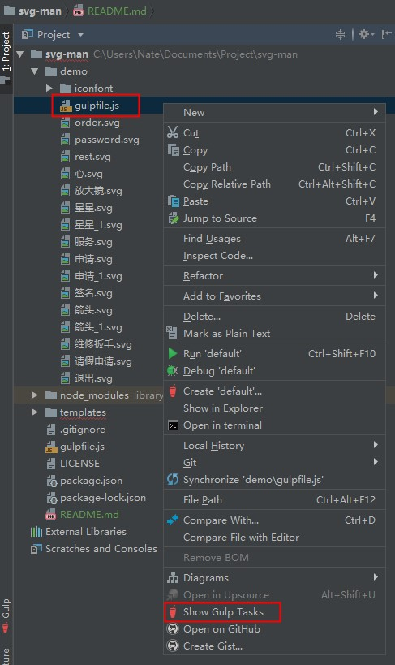
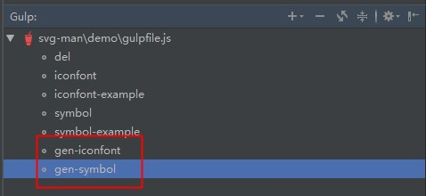

# install
```
npm i svg-man --save-dev
```

# usage
### files
```
assets
    |
    svgs
        |
        gulpfile.js
        1.svg
        2.svg
        3.svg
    other-dirs
```

content of `gulpfile.js`
```
// gulpfile.js
const gulp = require('svg-man')
gulp.config({
    fontName: 'ft-icon',
    prefix: 'ft'
})
```
config
* fontName: String
* prefix: String
* startUnicode: HEX Integer

### step 1

* right click `gulpfile.js`
* click `Show Gulp Tasks`



### step 2



#### run `gen-iconfont`
you will get some font files
```
assets
    |
    svgs
        |
        iconfont
            |
            fonts
                |
                xxx.wtff
                xxx.ttf
            iconfont.css
            iconfont-example.html
        gulpfile.js
        1.svg
        2.svg
        3.svg
    other-dirs
```

just import the iconfont.css in your main.js(VUE)

`import './assets/iconfont/iconfont.css'`

write this everywhere `<i class='prefix-xxx'></i>`.

**Well done!**

or

##### run `gen-symbol`
you will get one JS file
```
assets
    |
    svgs
        |
        iconfont
            |
            iconfont.js
            symbol-example.html
        gulpfile.js
        1.svg
        2.svg
        3.svg
    other-dirs
```

just import the iconfont.js in your main.js(VUE)

`import './assets/iconfont/iconfont.js'`

write this everywhere
```
<svg role="img" class="icon-symbol">
    <use xlink:href="#svg-id"></use>
</svg>
```
**Well Done!**